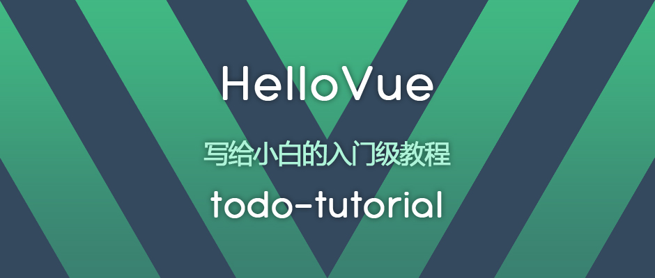

# HelloVue-todo-tutorial

	
   <strong>HelloVue-todo-tutorial</strong> 
  <strong>写给小白的 Vue.js 入门级教程</strong>。 
  每周五连载更新，基于 Vue2.x，带你从零开始一步步开发一个待办事项应用。

  
  
  

## 教程食用方式

本教程完全面向新人，非常易于食用和消化。教程连贯性较强，每一篇教程都是对前面内容的延伸和拓展，所以建议从头学到尾，达到循序渐进的效果。

每一步关键功能的开发都对应一篇详细的教程，并和历史提交（commit）以及标签（tag）一一对应。例如第一篇教程对应第一个 commit，对应标签为 step1，依次类推。

单篇教程结束时可能会留有练习，旨在利用教程中学到的和 Vue 官方文档中提及的知识点，增强我们开发的待办事项应用的功能，达到学以致用的目的。练习的代码不会包含在示例项目的源代码中，而是以文字解答的方式给出，请参考下方的教程目录索引。强烈建议学习时先通过独立思考完成练习，遇到困难时再参考标准解答。此外，参考解答也不一定是最优实现方案，如果你有更好的解决方案，欢迎提 issue 一起讨论。

本教程中的项目只需要一个文本编辑器和浏览器就可以上手开发，无需配置任何环境，因此强烈建议边学边动手实践，这样才能加深理解。

## 资源列表

更新中...

## 教程目录索引

**教程**

[第 1 篇：很高兴认识你 Vue.js](https://mp.weixin.qq.com/s/XdATD4-dabmjvaGf5dJxcw)

**练习参考解答**

[第 1 篇：很高兴认识你 Vue.js练习参考解答](./keys/1.md)

## 公众号

   
欢迎关注 HelloGitHub 公众号，获取更多开源项目的资料和内容。

## 版权声明

</a> 本作品采用<a rel="license" href="https://creativecommons.org/licenses/by-nc-nd/4.0/deed.zh">署名-非商业性使用-禁止演绎 4.0 国际 </a>进行许可。